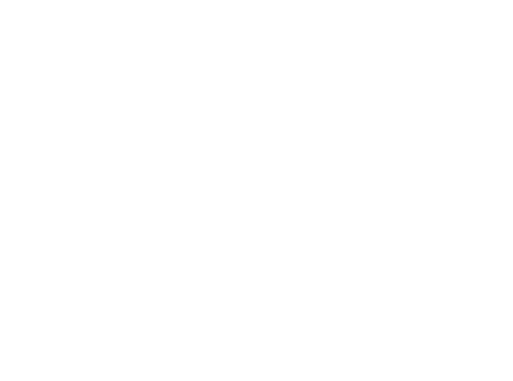

<div align="center">
    <picture>
    <source media="(prefers-color-scheme: light)" srcset="./images/logo-light.svg">
    <source media="(prefers-color-scheme: dark)" srcset="./images/logo-dark.svg">
    
    </picture>
</div>

<br>

[](https://github.com/TrySummon/summon-app/releases)
[](https://github.com/TrySummon/summon-app/blob/main/LICENSE)
[](https://www.ycombinator.com/companies?batch=S25)

**Your All-in-One Desktop App for Building, Testing and Sharing Model Context Protocol (MCP) Servers & AI Agents.**

---

The main features of the Summon app are:

| Features | Description |
|----------|-------------|
| **OpenAPI to MCP Generation** | Import OpenAPI specs, visually select endpoints to include in your MCP server. Combine multiple APIs into a single, cohesive server. |
| **API Auth** | Configure authentication for real API calls or use mock servers to test your MCP tools without external dependencies. |
| **External MCP Support** | Connect to any existing MCP server (local or remote) via `mcp.json` configuration. Support for CLI-based servers with automatic tool discovery. |
| **AI Playground** | Test MCP tool calling in an interactive chat interface with multiple AI models including OpenAI, Anthropic and more. |
| **Live Tool Editing** | Modify tool names, descriptions, and input schemas on the fly without restarting servers. View diffs of your modifications in real-time. |
| **Secure Credentials** | Store API keys and tokens safely using system keychain services. All credentials managed locally with secure authentication for AI providers and APIs. |

## 📺 Showcase

https://github.com/user-attachments/assets/f3ff8ef4-2ec8-4aa3-9d30-8d10bdc0b6ea

## 🚀 Getting Started

### 1. Download
Grab the latest release for your operating system from the [**GitHub Releases**](https://github.com/TrySummon/summon-app/releases) page.

### 2. Install
Follow the standard installation procedure for your OS:
*   **macOS:** Open the `.dmg` file and drag `Summon.app` to your Applications folder.
*   **Windows:** Run the `.exe` installer.
*   **Linux:** Use the `.rpm` or `.deb` package.

### 3. Launch Summon
Open the application and you're ready to go!

## 🗺️ Roadmap

We have exciting plans for Summon! Our collaborative roadmap, including upcoming features and long-term vision, can be found on our [website](https://www.trysummon.com/roadmap).

## 💻 For Developers (Building from Source)

If you want to contribute or run Summon from source:

1.  **Clone the repository:**
    ```bash
    git clone https://github.com/TrySummon/summon-app.git
    cd summon-app
    ```

2.  **Install dependencies:**
    ```bash
    npm install
    ```

3.  **Run the development server:**
    ```bash
    npm start
    ```

4.  **Build the application:**
    ```bash
    npm run make # For your current platform
    ```
    (See `package.json` for other build scripts.)

## 🏗️ Technology Stack

*   **Electron:** For cross-platform desktop application framework.
*   **Tailwind & shadcn:** For the user interface.
*   **TanStack Router & Query:** For routing and data fetching/caching.
*   **Zustand:** For global state management.
*   **Model Context Protocol SDK:** For MCP client/server interactions.
*   **AI SDK (Vercel AI SDK):** For LLM interactions in the Playground.
*   **Express:** For running local MCP servers and API mock servers.


## ❤️ Contributing

Contributions are welcome! Whether it's bug reports, feature requests, or code contributions, please feel free to:

1.  Check our [Contribution Guidelines](CONTRIBUTING.md).
2.  Open an issue on the [GitHub Issues page](https://github.com/TrySummon/summon-app/issues).
3.  Fork the repository and submit a pull request.

---

<p align="center">
  Made with ❤️ by the Summon Team
</p>
